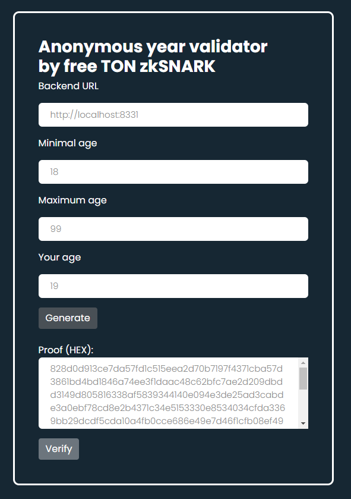

# Anonymous year validator by free TON zkSNARK

## Description

Progress is the engine of development. The progress gives the vector of movement to the modern world. We use various gadgets every day, leave traces on the Internet and open our privacy everywhere. But confidentiality is very important and it would be correct to hide some information about yourself. How can we use this? zk-SNARKs - Zero Knowledge Proof.

The purpose of zero knowledge proofs is for the verifier to be able to verify that the verifier has knowledge of a secret parameter called 
proof that satisfies some relationship without disclosing the proof to the verifier or anyone else - for example:
* If I want to go to any event with a high MPAA rating and am not ready to disclose my personal information to others;
* If I want to participate in extreme sports games and I want to hide this information from my bank / lender;
* If I want to buy alcohol, cigarettes, but I am not ready to reveal my age;
* If I want to get medical care, but I do not want anyone to know about it.

One of the important criteria for all these scenarios is the confirmation of my age (and it's limitation by law).

The main idea of this solution is to protect privacy (age) from anyone and begin to reduce the existing leakage 
of confidential information of each of us by introducing blockchain technologies into our life!

This extension was created as solution for ["Groth16 zkSNARK Proof Verification Use Cases Part II"](https://forum.freeton.org/t/contest-proposal-groth16-zksnark-proof-verification-use-cases-part-ii/11291) competition.

	
## How it works

Somebody (governance or private organization) can create a free TON solidity contract 
with snark that can validate my age and get the answer, is the user is accepted by age (from - until). 

After then, anybody generate proof of their age and can validate this by contract.

As the result - anybody can prove their age and private informations doesn't send outside of his computer/mobile.

This solution use blueprint zkSNARK library to check that user age is included in years range (from <= your year <= until).

## Solution

### zsSnark-Logic 

C++ application based on blueprint library. You can:
- Generate proving.key and verification.key
- Generate and save proof to file
- Generate and save and primary_input to file 
- Check/Verify the proof

### Free TON Blockchain 

Free TON Contract to validate zsSnark proof using Vergrth16 TVM.
A verification key is stored in the Free TON Solidty contract.
It can be setted/changed using the setupKey method:
```
    // Setup validation key
    function setupKey(bytes vkey) public {
        // security validation 
        require(msg.pubkey() == tvm.pubkey(), 150);
        tvm.accept();
        m_vkey = vkey;
    }
```

### Demo server application (node) and HTML page

This demo interactively generates and validates proofs by user inputted data:
* Proof is generating by node solutions (which use znSnarkl-Logic CLI application);
* Proof is validating by Free TON blockchain using Verification Free TON Solidity contract.

**Unfortunately, NIL network is switched off and I can't publish my contract to it. So I’ve been testing my contract locally.**


## Compilation & usage

### Prerequirements

#### GIT ####
https://git-scm.com/
#### Cmake & Boost ####

https://cmake.org/ and https://www.boost.org/.

It is better to compile Boost solution locally to get last version (some linux repositories contain not actual version). 

Get the version of Boost:
```
wget -O boost_1_77_0.tar.gz https://sourceforge.net/projects/boost/files/boost/1.77.0/boost_1_77_0.tar.gz/download
tar xzvf boost_1_77_0.tar.gz
cd boost_1_77_0/
```
Get the required libraries:
```
sudo apt-get update
sudo apt-get install build-essential g++ python-dev autotools-dev libicu-dev libbz2-dev libboost-all-dev
```
Boost's bootstrap setup:
```
./bootstrap.sh --prefix=/usr/
```
Then build it with:
```
./b2
```
and eventually install it:
```
sudo ./b2 install
```
#### Npm & Node & Node.js
https://docs.npmjs.com/downloading-and-installing-node-js-and-npm
      
### zsSnark-Logic 

#### Compilation

1. Clone from GIT to local copy:
```
git clone https://github.com/podlodkin/podlodkin-freeton-year-control --recursive
```
NB! You must create and register GIT SSH key to successfully get all linked libraries!

2. Create build catalogue:
```
cd podlodkin-freeton-year-control/snark-logic 
mkdir build 
cd build
```

3. Compile solution:
```
cmake .. 
make cli
```

#### Usage

1. Generate keys (proving and verification):
```
bin/cli setup
```
Result:
```
$ bin/cli setup
Blueprint size: 114
Generating constraint system...
Number of R1CS constraints: 115
Generating keypair...
Saving proving key to a file "proving.key"
Saving verification key to a file "verification.key"
```
As the result you give two files: "proving.key" and "verification.key".

2. You can try to generate the proof for some correct age:
```
bin/cli prove --year 19 --minYear 18 --maxYear 99
```
Result:
```
$ bin/cli prove --year 19 --minYear 18 --maxYear 99
Loading proving key from a file "proving.key"
Generating constraint system...
Generating witness...
Blueprint is satisfied: 1
Generating proof...
Saving proof to file "proof"
Saving primary input to file "primary.input"
```
As the result you give file "primary.input".

3. After then you can verify proof file using saved "primary.input" file and "verification.key":
```
bin/cli verify
```
Result:
```
$ bin/cli verify
Loading proof from a file "proof"
Loading primary input from a file "verification.key"
Loading verification key from a file "primary.input"
Verification status: 1
```

4. You can try to generate the proof for some incorrect age:
```
bin/cli prove --year 7 --minYear 18 --maxYear 99
```
Result:
```
$ bin/cli prove --year 7 --minYear 18 --maxYear 99
Loading proving key from a file "proving.key"
Generating constraint system...
Generating witness...
Blueprint is satisfied: 0
```
Blueprint is not satisfied.

#### Testing
Build and run unit tests:
```
cd snark-logic/unit-tests/
cmake .. -DBUILD_TESTS=1
make snark_logic_test
./unit-tests/snark_logic_test
```
Result:
```
$ ./unit-tests/snark_logic_test
Running 2 test cases...
Testing 5 in range (2, 100)
Testing 1 in range (2, 100)
Testing 101 in range (2, 100)
No errors detected
```

### Demo Web application 

#### Running node
1. Copy newly compiled cli and actuals proving.key and verification.key to ./demo/node/assets.
2. Run node:
```
cd ./demo/node
npm install
npm run dev
```
Node listening on localhost:8331.


### HTML web page
Open in browser ./demo/demo.html page (as file) and use it.


